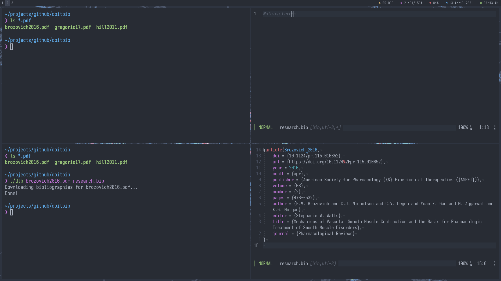

# doitbib

*doitbib*, for "Do it! Bib!" or "DOI To Bib", is a simple shell script that generates BibTeX citations from articles.

When you provide a PDF file or a DOI number, the script extracts the DOI, queries
[Crossref](https://crossref.org) for bibliography information, and downloads the BibTeX entry corresponding to the associated literature to a .bib file of your choosing.

In one command, you have just gathered every bibliographic information available about that article into one organized file.

## Installation

In addition to `bash` for running Bash scripts, you will need `pdfinfo` and `pdftotext` installed on your device. For mainstream Linux distributions, they should already be installed. If not, install `poppler-utils` using your respective package manager, such as

```sh
sudo apt-get install poppler-utils    # Ubuntu, Debian, or derivatives
sudo dnf install poppler-utils        # Fedora
sudo pacman -S poppler-utils          # Arch or derivatives
```

or download prebuilts of the `xpdf` command line tools from [here](https://www.xpdfreader.com/download.html) if using
macOS or Windows.

Then, clone this repository:

```sh
git clone https://github.com/ourigen/doi2bib.git
```

## Usage

To use, make sure that the script is in the same folder as your article PDFs and `.bib` file. Then, run the script like so:

```
./dtb article.pdf citation.bib
```

where `article.pdf` and `citation.bib` are replaced with the names of article you want to cite and your BibTeX file, respectively.

Please make sure to verify that a BibTeX entry was found for each file by viewing your `citation.bib`. If no BibTeX entry was extracted for your article, open the PDF and find the DOI number. Then, run the script with the number in place of the file name, like so:

```
./dtb 10.doi.number citation.bib
```

where `10.doi.number` and `citation.bib` are replaced with the DOI of the article and the name of your BibTeX file, respectively.

### See It In Action



## Advanced Usage

Suppose you have a folder just ***full*** of PDF articles. Rather than going through each one-by-one, you can use this script to get BibTeX entries for the entire directory like so:

```
for x in *.pdf; do
./dtb "$x" citation.bib
done
```

where `citation.bib` is the name of your bibliography file, respectively. Make sure you are performing this action in the folder where your articles are saved. This will run the script on every PDF file and gather the bibliography information into `citation.bib`.

Remember to double check your file to ensure that a BibTeX entry is found for every article. If there is an error in the DOI extraction, search for the DOI number yourself and run the script with the number instead of the filename.

## Planned Features

Though the script is functional, there is room for improvements. Here are some things I would like to or implement:

* [ ] (House cleaning) Upload usage GIFs for clarity
* [ ] Check if DOI was found for PDF and warns user if not
* [ ] Identifies if DOI spans to 2 lines and `grep` its entirety
* [ ] Integrate PubMed/arXiV?

## License

This script is licensed under [GNU General Public License](LICENSE.md).
